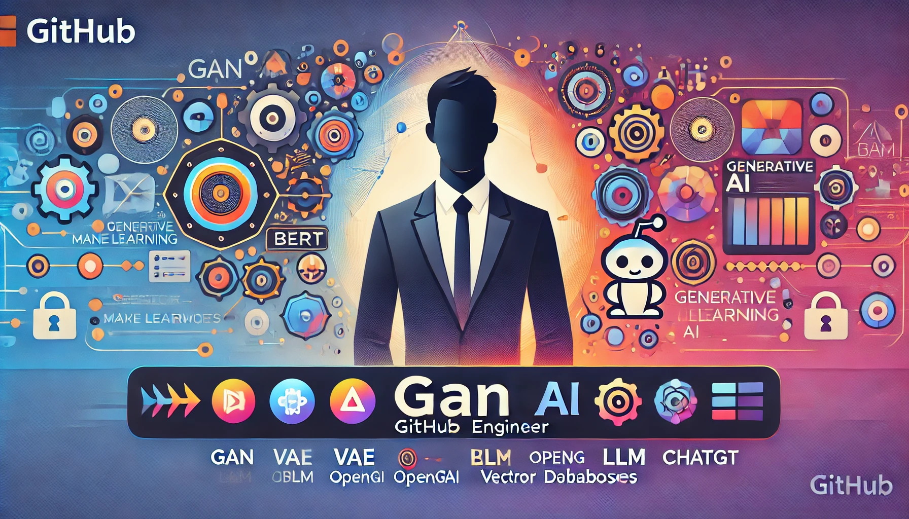

  
  

<h1 align="center">Hi 👋, I'm Lal Dangal</h1>
<h3 align="center">🚀 Generative AI Engineer | Deep Learning Engineer | NLP Engineer | Data Scientist 🚀</h3>

  
  
  

---

<h2 align="center">⚡ About Me ⚡</h2>

- 🔭 **I’m a dedicated professional specializing in Generative AI and Machine Learning.**
- 🌱 **Currently enhancing skills in:** Azure Databricks, Azure Data Factory, Deep Learning, LLM Models, LangChain, Transformers, and NLP.
- 💡 **Passionate about:** Building intelligent systems, solving complex problems, and creating cutting-edge AI solutions.
- 📫 **Reach out to me via:** [ibanath.dangal@gmail.com](mailto:ibanath.dangal@gmail.com)

---

<h2 align="center">🛠️ Languages & Tools 🛠️</h2>

  
  
  
  
  
  
  
  
  
  

---

<h2 align="center">💼 Professional Experience 💼</h2>

- **Generative AI Engineer** - Working on advanced LLM models, developing end-to-end AI solutions, and leveraging vector databases.
- **Deep Learning & NLP Engineer** - Expertise in transformers, language models, and neural networks to build intelligent systems.
- **Azure Cloud Data Engineer** - Skilled in Azure Synapse, Azure Data Factory, and Databricks for big data solutions.

---

<h2 align="center">📊 GitHub Stats 📊</h2>

  
  
  

---

<h2 align="center">📚 Featured Projects 📚</h2>

- **[Generative AI for Pharmacy Fraud Detection](https://github.com/candidlpd/pharmacy-fraud-ai):** Developed a generative AI model to analyze and detect fraudulent pharmacy practices using advanced deep learning techniques.
- **[NLP Contract Analysis](https://github.com/candidlpd/contract-nlp):** NLP solution to automate the analysis of legal contracts, extracting key clauses and insights.
- **[Azure Data Engineering Pipelines](https://github.com/candidlpd/azure-data-pipeline):** End-to-end data pipelines on Azure, integrating data from multiple sources and ensuring seamless data flow.

---

<h2 align="center">🌐 Connect with Me 🌐</h2>

  
  
  

" alt="Logo" width="150" height="150">

<h1 align="center">Hi 👋, I'm Lal Dangal</h1>
<h3 align="center">🚀 Generative AI Engineer | Deep Learning Engineer | NLP Engineer | Data Scientist 🚀</h3>

  
  
  

---

<h2 align="center">⚡ About Me ⚡</h2>

- 🔭 **I’m a dedicated professional specializing in Generative AI and Machine Learning.**
- 🌱 **Currently enhancing skills in:** Azure Databricks, Azure Data Factory, Deep Learning, LLM Models, LangChain, Transformers, and NLP.
- 💡 **Passionate about:** Building intelligent systems, solving complex problems, and creating cutting-edge AI solutions.
- 📫 **Reach out to me via:** [ibanath.dangal@gmail.com](mailto:ibanath.dangal@gmail.com)

---

<h2 align="center">🛠️ Languages & Tools 🛠️</h2>

  
  
  
  
  
  
  
  
  
  

---

<h2 align="center">💼 Professional Experience 💼</h2>

- **Generative AI Engineer** - Working on advanced LLM models, developing end-to-end AI solutions, and leveraging vector databases.
- **Deep Learning & NLP Engineer** - Expertise in transformers, language models, and neural networks to build intelligent systems.
- **Azure Cloud Data Engineer** - Skilled in Azure Synapse, Azure Data Factory, and Databricks for big data solutions.

---

<h2 align="center">📊 GitHub Stats 📊</h2>

  
  
  

---

<h2 align="center">📚 Featured Projects 📚</h2>

- **[Generative AI for Pharmacy Fraud Detection](https://github.com/candidlpd/pharmacy-fraud-ai):** Developed a generative AI model to analyze and detect fraudulent pharmacy practices using advanced deep learning techniques.
- **[NLP Contract Analysis](https://github.com/candidlpd/contract-nlp):** NLP solution to automate the analysis of legal contracts, extracting key clauses and insights.
- **[Azure Data Engineering Pipelines](https://github.com/candidlpd/azure-data-pipeline):** End-to-end data pipelines on Azure, integrating data from multiple sources and ensuring seamless data flow.

---

<h2 align="center">🌐 Connect with Me 🌐</h2>

  
  
  

